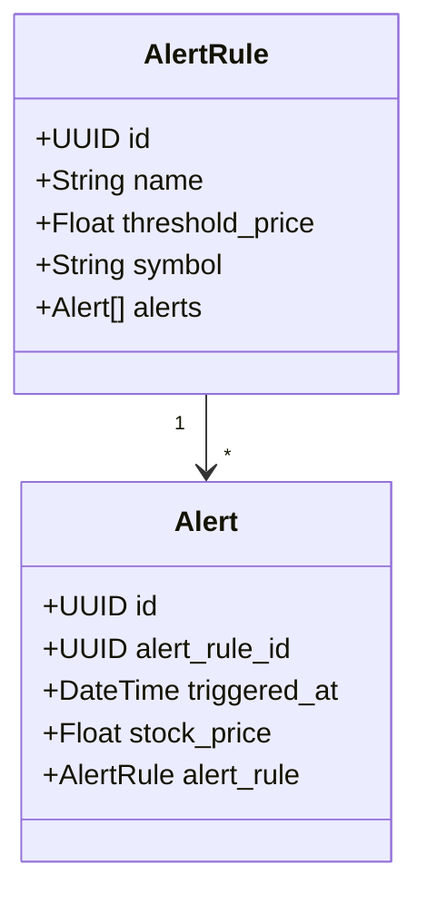
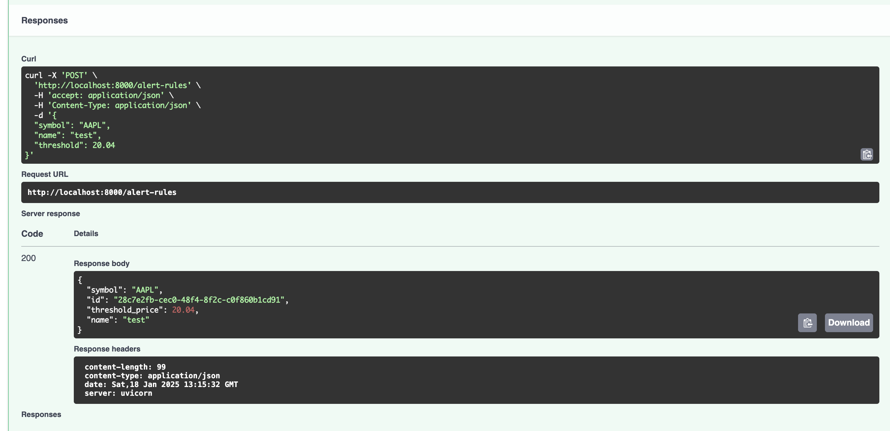
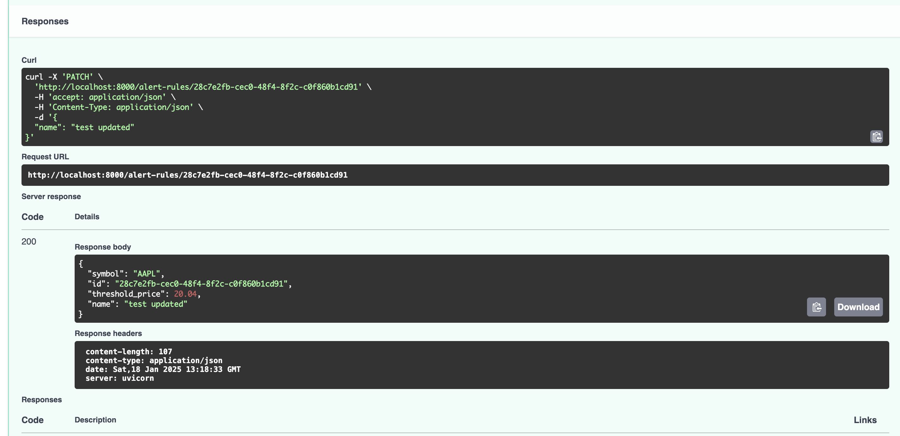
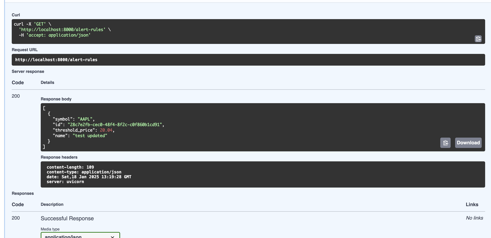
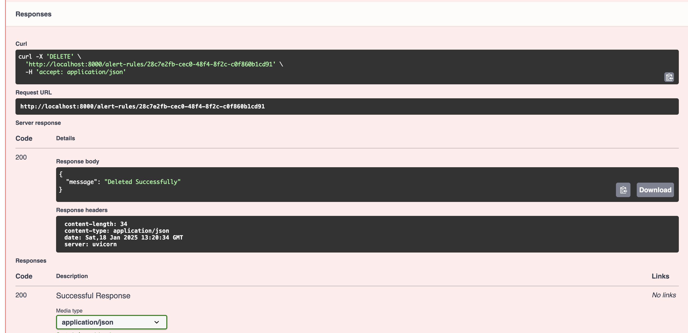
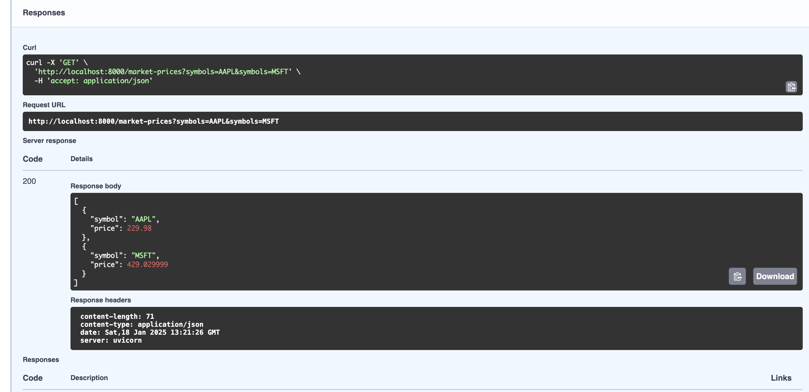
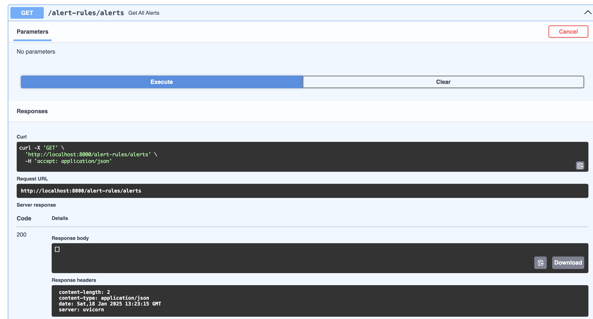

# PHASE ONE (Getting to know FastAPI)
## Technology used

- FastAPI (Backend Framework)
- Uvicorn (Python Web Server)
- Docker & Docker Compose
- Cockroachdb (Database)
- SQLAlchemy (ORM)
- Pydantic (Scheme Validation)

## Objectives

Build a `FASTAPI` server that retrieve the latest stock market prices from and external resource [Rapid API](https://rapidapi.com/twelvedata/api/twelve-data1) and give the user the ability to manage a custom alert rules by preissiting them in a database so they can crate/update/delete/read thier rules

### Class Digram


### Prerequisites
Before getting started, ensure you have the following prerequisites installed on your system:

- Docker
- Docker Compose
- Git 


## Setup
- Clone the repository to your local machine:
```bash
git clone https://github.com/MohamedAbdElMeged/investor_bulletin.git

cd investor_bulletin
```
- change dir to the phase you want
```bash
cd phase_1
```
- Make sure the `up.sh` and `down.sh` are executable
```
sudo chmod +x up.sh
sudo chmod +x down.sh
```

- start the project :
```bash
make up
```
> This command will download the necessary Docker images, build the application, start the containers and setup the database.

<hr>

### Useful Urls
- API url: http://0.0.0.0:8000
- Swagger url: http://0.0.0.0:8000/docs
- Cockroach ui: http://0.0.0.0:8080


### File Structure
```
.
├── README.md
├── imgs
└── phase_1
    ├── Dockerfile
    ├── Makefile
    ├── README.md
    ├── docker-compose.yml
    ├── down.sh
    ├── entrypoint.sh
    ├── investor_bulletin
    │   ├── alembic.ini
    │   ├── api
    │   │   ├── __init__.py
    │   │   ├── controllers
    │   │   │   ├── __init__.py
    │   │   │   ├── market_controllers.py
    │   │   │   └── rules_controller.py
    │   │   ├── main.py
    │   │   └── routes.py
    │   ├── common
    │   │   └── stock_symbols.py
    │   ├── db
    │   │   └── models
    │   │       ├── __init__.py
    │   │       ├── model_base.py
    │   │       └── models.py
    │   └── resources
    │       ├── alert_rules
    │       │   ├── __init__.py
    │       │   ├── alert_rule_dal.py
    │       │   ├── alert_rule_model.py
    │       │   ├── alert_rule_schema.py
    │       │   └── alert_rule_service.py
    │       ├── alerts
    │       │   ├── alert_dal.py
    │       │   ├── alert_model.py
    │       │   ├── alert_schema.py
    │       │   └── alert_service.py
    │       └── market
    │           ├── __init__.py
    │           ├── market_schema.py
    │           └── market_service.py
    ├── requirements.txt
    ├── sql
    │   └── init.sql
    └── up.sh
```

<hr>

### API Endpoints
- Create Alert Rule


- Update Alert Rule


- Get All Alert Rules


- Delete Alert Rule


- Get Market Prices


- Get Alerts


<hr>
